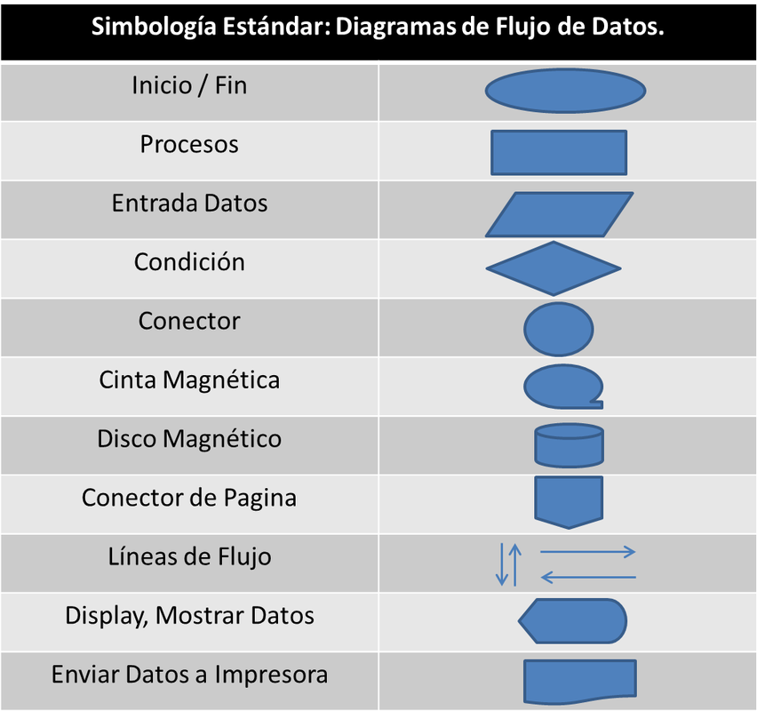

# juan b  
  

    # Elementos de un Diagrama de Flujo en la Programación

Un **diagrama de flujo** es la representación gráfica de un algoritmo o un proceso. En la programación, es una herramienta fundamental para planificar la lógica de un programa antes de escribir una sola línea de código. 

A continuación, se detallan los elementos (símbolos) estándar utilizados en los diagramas de flujo y su significado en el contexto de la programación.

---

## 1. Elementos Principales y Símbolos

### 📌 Terminal (Inicio / Fin)
* **Forma:** Óvalo o elipse.
* **Función:** Indica el punto de partida (inicio) y el punto de cierre (fin) del algoritmo o proceso. Todo diagrama de flujo debe tener exactamente un inicio y al menos un fin.
* **Ejemplo:** `Inicio`, `Fin`.

### 🔲 Proceso
* **Forma:** Rectángulo.
* **Función:** Representa cualquier operación que modifique los datos, como asignaciones, cálculos aritméticos o transformaciones de variables.
* **Ejemplo:** `x = a + b`, `contador = contador + 1`.

### 🔄 Decisión
* **Forma:** Rombo.
* **Función:** Representa una evaluación lógica o condición (pregunta). Tiene una entrada y **dos o más salidas** (generalmente etiquetadas como *Sí / No* o *Verdadero / Falso*), determinando el flujo que seguirá el programa según se cumpla o no la condición.
* **Ejemplo:** `¿Es x > 10?`.

### 📥 / 📤 Entrada y Salida (Datos)
* **Forma:** Paralelogramo.
* **Función:** Se utiliza para la lectura de datos de entrada (por ejemplo, desde un teclado) o para mostrar resultados al usuario (salida por pantalla).
* **Ejemplo:** `Leer nombre`, `Mostrar "Hola, mundo"`.

### ➡️ Líneas de Flujo (Conectores)
* **Forma:** Flechas (`→`, `↓`, `↑`, `←`).
* **Función:** Indican el orden de ejecución de las operaciones (la dirección del flujo). Conectan los diferentes símbolos entre sí.

### ⭕ Conector Interno / De Página
* **Forma:** Círculo pequeño.
* **Función:** Sirve para enlazar partes distintas de un diagrama complejo dentro de la misma página, evitando que las líneas de flujo se crucen y confundan.

---

## 2. Ejemplo Práctico

Imagina un algoritmo sencillo para saber si un número ingresado por el usuario es **par o impar**. Su representación conceptual sería la siguiente:

1. **[Inicio]** ➔ (Terminal)
2. ➔ **Leer número `n`** ➔ (Entrada)
3. ➔ **¿`n % 2 == 0`?** ➔ (Decisión)
   * *Si (Verdadero)* ➔ **Mostrar "Es par"** ➔ **[Fin]**
   * *No (Falso)* ➔ **Mostrar "Es impar"** ➔ **[Fin]**

---

## 3. Buenas Prácticas al Crear Diagramas de Flujo

* **De arriba hacia abajo y de izquierda a derecha:** El flujo natural de lectura debe respetarse para evitar confusiones.
* **Claridad en los textos:** Los textos dentro de las figuras deben ser breves, concisos y utilizar preferiblemente sintaxis cercana a la programación o lenguaje natural estructurado.
* **No cruzar líneas:** Utiliza los conectores circulares si el diagrama es muy extenso para evitar que las flechas se crucen y creen un enredo visual (*espagueti*).
* **Unicidad:** Cada símbolo de decisión debe tener salidas claramente identificadas para no dejar caminos ambiguos.

